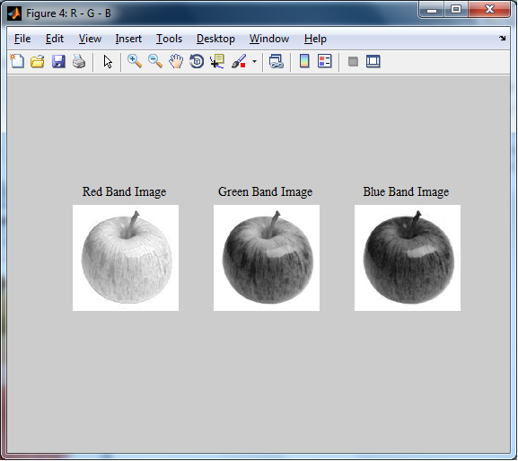
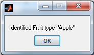

# 🍎 Fruit Detection and Classification using Computer Vision

## 📌 Project Overview

The **Fruit Detection and Classification** project is an automated system developed using **MATLAB** that identifies and classifies fruits based on visual characteristics. The system applies **computer vision techniques** and a **feedforward neural network** to analyze fruit images, extract meaningful features, and accurately determine the fruit type.

This project aims to reduce manual inspection, improve classification accuracy, and support applications in **agriculture**, **food quality control**, and **automated sorting systems**.

---

## ⚙️ System Methodology

### 1️⃣ Image Acquisition

Fruit images are collected and stored in a structured dataset for training and testing.

### 2️⃣ Image Preprocessing

* Image resizing
* Noise reduction
* RGB color space separation

### 3️⃣ RGB Band Separation

Each input image is split into:

* **Red Band**
* **Green Band**
* **Blue Band**

These bands help analyze color intensity differences between fruit types.

📷 **Sample RGB Band Output:**
[](Images/RGB.png)

### 4️⃣ Feature Extraction

* Color features
* Texture features (GLCM, Color Autocorrelogram)

### 5️⃣ Classification

A **feedforward neural network** is trained using extracted features.
The trained model classifies the fruit based on learned patterns.

📷 **Classification Result Output:**
[](Images/OUTPUT.png)

Example output:

```
Identified Fruit type: Apple
```

---

## 🧠 Technologies Used

* **MATLAB R2013a**
* Computer Vision
* Image Processing Toolbox
* Feedforward Neural Network
* Feature Extraction Algorithms

---

## ✅ Advantages

* Reduces human effort in fruit inspection
* Improves classification accuracy
* Simple and efficient implementation
* Suitable for academic and real-world use

---

## 🌍 Applications

* Agricultural quality control
* Automated fruit sorting systems
* Food processing industries
* Smart farming applications
* Academic and research projects

---

## 📁 Project Structure

```
Fruit_detection/
│── Training/
│   └── Fruit images
│── Source Code/
│   ├── training.m
│   ├── training1.m
│   ├── glcm.m
│   ├── colorAutoCorrelogram.m
│   └── target_main.mat
│── images/
│   ├── RGB.png
│   └── OUTPUT.png
│── README.md
```

---

## 🚀 Future Enhancements

* Integration of deep learning models (CNN)
* Real-time fruit detection using live camera feed
* Improved feature extraction techniques
* Web or mobile application deployment

---
